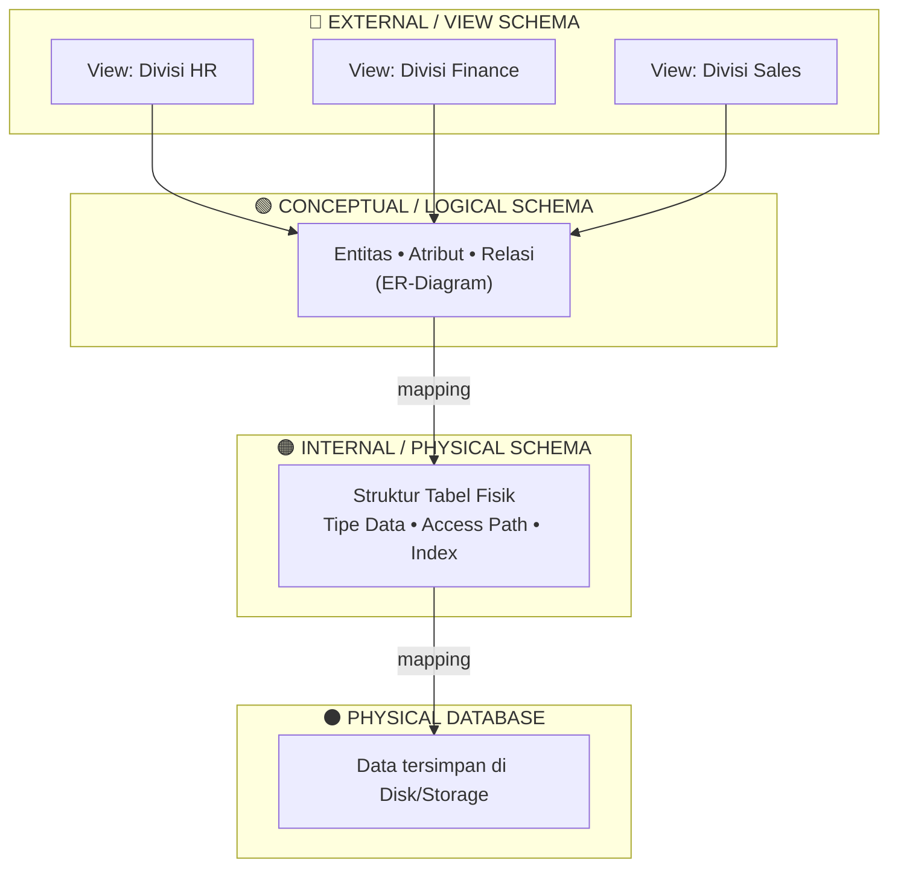

## DATABASE SCHEMA (BLUEPRINT DASAR)

**Skema** adalah kerangka dasar atau cetak biru (`blueprint`) yang mendefinisikan bagaimana data diorganisasi, tipe datanya, dan relasi antartabel. Secara logika, skema harus didesain sebelum data aktual dimasukkan (fase `data modeling`) agar aplikasi memiliki panduan terstruktur dan persis tahu bagaimana cara membaca/menyimpan data.

## PERBEDAAN DEFINISI SKEMA (MySQL vs SQL Server vs PostgreSQL vs Oracle)

Pemahaman istilah "skema" bergantung pada `Database Management System` (DBMS) yang digunakan. Di **MySQL**, skema identik dan bisa ditukar-sebut dengan database itu sendiri. Di **SQL Server**, skema adalah koleksi objek (tabel, tipe data, keys). Di **PostgreSQL**, skema bertindak sebagai `namespace` untuk objek database. Sedangkan di **Oracle**, skema secara ketat diikat, didedikasikan, dan dinamai berdasarkan pengguna (`user`).

## CONCEPTUAL / LOGICAL SCHEMA

Lapisan ini berfokus pada "apa" data yang disimpan (entitas, atribut, relasi), bukan "bagaimana" penyimpanannya. Mengapa ini penting? Lapisan ini mengaburkan (`hide`) detail fisik penyimpanan agar software developer bisa fokus pada struktur bisnis dan logika entitas (biasanya direpresentasikan lewat `Entity Relationship Diagram` / ER-D).

## INTERNAL / PHYSICAL SCHEMA

Lapisan ini berfokus pada "bagaimana" data direpresentasikan pada level penyimpanan terendah (`storage`/`disk`). Skema fisik bekerja murni untuk optimasi mesin—menentukan secara pasti wujud tabel fisik, tipe data memori, dan jalur akses (`access paths`) agar pengambilan data menjadi sangat efisien.

## EXTERNAL / VIEW SCHEMA

Lapisan ini berfungsi murni untuk keamanan (`security`) dan abstraksi data berbasis peran (`role-based`). Logikanya: tidak semua user boleh melihat struktur penuh database. Skema eksternal menciptakan "kacamata khusus" berupa subset database untuk user tertentu (misal: divisi HR hanya bisa melihat struktur data pegawai, tanpa mengetahui adanya tabel data finansial).

## EFEK DOMINO DESAIN SKEMA

Desain skema yang buruk akan memaksa engineer melakukan `reverse-engineering` di masa depan yang memakan waktu dan biaya besar. Skema yang terdefinisi dengan kuat di awal adalah prasyarat mutlak untuk menghasilkan query yang efisien untuk analitik, menjaga konsistensi/kebersihan data, dan mempermudah pengaturan isolasi hak akses keamanan antar-objek database.

---

# Three-Schema Architecture

Diagram ini menggambarkan tiga lapisan (layer) arsitektur skema database, dari yang paling dekat dengan user hingga yang paling dekat dengan penyimpanan fisik.

## Penjelasan Tiap Lapisan

**External / View Schema** — Lapisan teratas, berupa banyak "kacamata" berbeda untuk tiap kelompok user. Setiap divisi hanya melihat subset data yang relevan untuk mereka (fungsi keamanan & abstraksi berbasis peran).

**Conceptual / Logical Schema** — Lapisan tengah, satu representasi tunggal yang menyatukan seluruh kebutuhan dari berbagai view di atasnya. Fokus pada "apa" data yang ada (entitas, atribut, relasi), tanpa peduli detail penyimpanan fisik.

**Internal / Physical Schema** — Lapisan yang menerjemahkan skema konseptual ke bentuk teknis: bagaimana tabel benar-benar disusun, tipe data disimpan di memori, dan jalur akses (access path) dioptimalkan.

**Physical Database** — Lapisan paling dasar, tempat data benar-benar tersimpan sebagai bytes di disk/storage.
